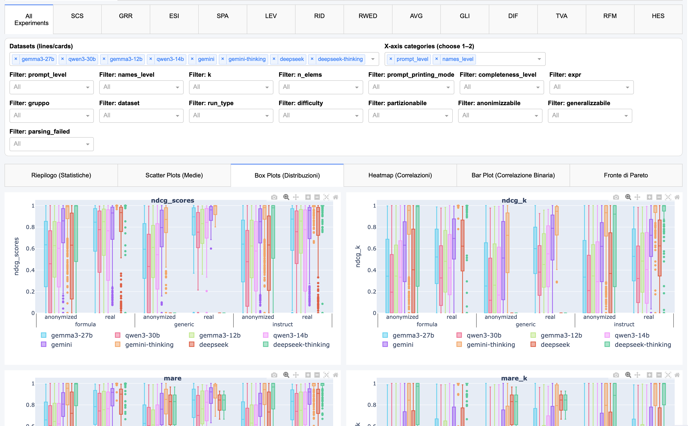

# SERA: Evaluating LLM-based SEmantic RAnking over Structured Tables

## Setup and requirements
The code is implemented in `python 3.12` and requires the set of packages listed in `requirements.txt` file, which can be installed with:
```bash
pip install -r requirements.txt
```

### Datasets
The datasets used for the experiments need to be placed within the `data` folder, each under a separate folder named as per the following list, which contains the datasets used in our experiments with their link:
- [planets](https://phl.upr.edu/hwc/data) (the `simplified catalog` file)
- [cities](https://en.wikipedia.org/wiki/Global_Liveability_Index) (the `lobal Liveability Index 2020` table was extracted and saved as `global_liveability.xlsx`)
- [hr](https://www.kaggle.com/code/faressayah/ibm-hr-analytics-employee-attrition-performance/input)
- [meters](https://www.kaggle.com/datasets/jeanmidev/smart-meters-in-london) (`the block_0.csv` file under `hhbloc_dataset/hhbloc_dataset` folder)
- [molecules](https://doi.org/10.24432/C5WW4F) (the `new_dataset.csv` file under `dataset_Similarity_Prediction/new_dataset`)
- [goodreads](https://cseweb.ucsd.edu/~jmcauley/datasets/goodreads.html#datasets) (the extracted `goodreads_reviews_dedup.json.gz` file)
- [purchases](https://doi.org/10.24432/C5BW33)
- [smartphones](https://www.kaggle.com/datasets/sady36/mobile-phones-specs)

All archives must be extracted. 

### Backends
Our execution requires following backends:
- `together`: Together AI platform (https://together.xyz/), which requires the `TOGETHER_API_KEY` env var.
- `openrouter`: OpenRouter platform (https://openrouter.ai/), which requires the `OPENROUTER_API_KEY` env var.
- `google`: Google Gemini API, which requires the `GOOGLE_API_KEY` env var.
- `ollama`: used for local execution with Ollama (https://ollama.com/), which requires `VM_HOSTNAME` env var to be set to the hostname of the machine where Ollama is running (e.g., `localhost`).

The  env vars can be set in the `.env` file, which needs to be placed in the root folder.

## Execution
### Run configuration
The run configuration is defined with a `.yaml` file, which needs to be placed within the `experiments` folder.
This file specifies models/beckends, execution modes, experiments and their configuration to be run.
File structure is as follows:
```yaml
models:
    - name: {backend}/{model_name} # as available under models/
      batched: true/false # whether to run the model in batch mode or not, for those that supports it
      temperature: float # optional, if specified the model will be executed with this temperature value instead of the default one
      run_type_filter: [run_type_1, run_type_2, ...] # optional, if specified only the specified execution modes will be executed for this model
run_types: [execution_mode] # list of execution modes to be run, if not specified all will be executed
seed: int # the seed to be used for queries generation, if not specified a random seed will be generated
queries: # list of experiments to be run, with their configuration
  - name: {dataset}/{expr_name} # as available under queries
    n_queries: int # the number of queries to be generated for each combination of the parameters specified below
    elems_per_query: [int] # list of number of prompt's dataset's rows
    names_levels: [name_level] # list of name modes ('real' and 'fake', for anonymized names, for those experiments that support it)
    prompt_levels: [prompt_level] # list of prompt modes ('instruct', 'formula' and 'generic' for those experiments that support it)
    completeness_levels: [completeness_level] # list of completeness levels ('total', 'mask' for those experiments that support it)
    kp: [int] # list of integers for the top-k parameter
  - ...
```
The run configuration file `all.yaml` contains the setup used for our work.
The `prompts_samples` folder contains a sample of each type of prompt generated with this configuration.

### Execution
To run a configuration, pass the file’s name to `experimenter.py` as follows:
```bash
python experimenter.py [config_file_name]
```
This will create a folder under `runs/`, named as the configuration file.
There, the execution will generate the test files (the queries that will be submitted to the specified models), store the execution status and the results, with the following structure:
```
{run_config_file_name}/
    {dataset}/
        {test_name}/
            data/
                {run_mode}/
                    prepared_queries.csv # contains the generated queries for this experiment, with the paramers spcieifed in the run configuration file.
        results/
            {model_name}/
                {run_mode}/
                    evaluated_queries.csv # contains the results of the execution, with the model's answers and the evaluation metrics for each query.
```

### Results
Results can be viewed directly from their `evaluated_queries` csv file, or via the integrated dashboard:
```bash
python dashboard.py [run_config_file_name]
```
The dashboard enables the exploration of experimental results through a customizable set of filters reflection the test parameters.
It provides various visualizations, such as scatter plots, heatmaps, and Pareto frontiers.
It can be accessed at `http://localhost:8050/` after running the above command.
